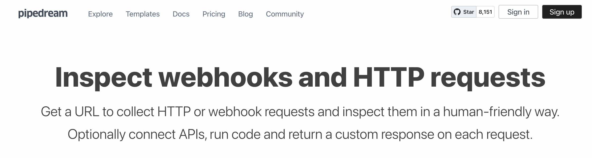
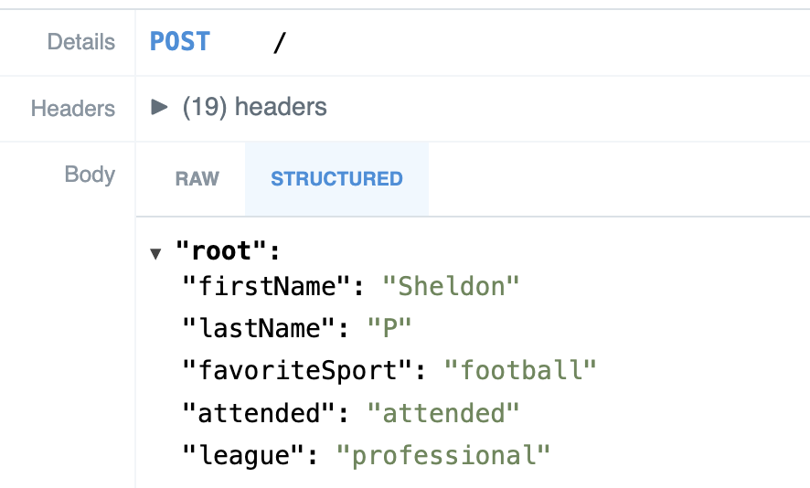
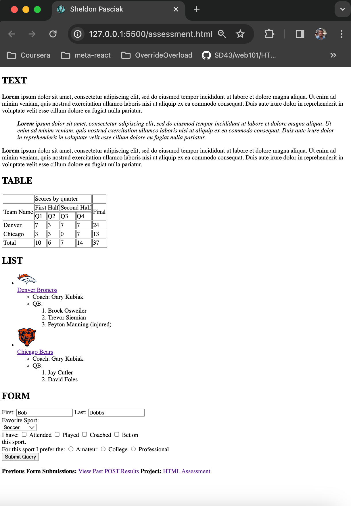

# HTML Assessment

#### Description

- This is the HTML basics assessment.

- I implemented the features as instructed.

- I added a border for the table to show how it is divided using colspan and rowspan.

- Your form will actualy POST to a backend, and the link in the footer can be used to show past POST results.

#### Technologies Used

    - HTML
    - VS Code
    - Git/GitHub

#### External technology/libraries used:

    - Request Bin - https://public.requestbin.com/

#### Lessons Learned

    - Implementing minimal client/server for form POST.

#### Example Post Results

#### My Created Assessment HTML File - Screenshot

